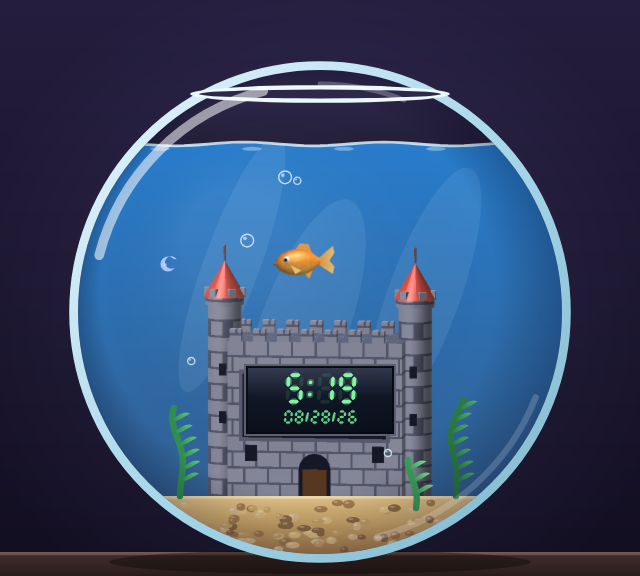
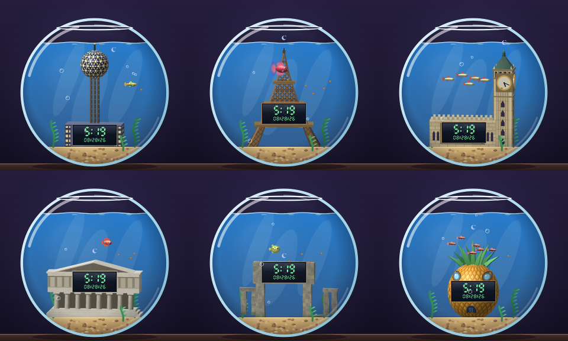

# 🐠 virtual-fish-gotcha

A cozy virtual fish that lives in your browser, drawn the way a 2001 console would have drawn it: low-poly 3D fish and landmarks baked to sprites, a glass bowl with real highlights, and an LED clock that shows the date. Feed it, play with it, keep its bowl clean — and read the time off the little landmark it swims around. Pick from seven fish and eight structures.

<p align="center"></p>

- Scene rendered at 640×576 on a `<canvas>`, React for the panels. Every fish and landmark is a low-poly 3D model rendered offline to a sprite sheet by an in-repo software rasterizer (`bun run sprites` — Gouraud shading, specular, procedural textures, no GL); the bowl, water, plants and bubbles are vector-shaded at runtime.
- Stats **Full / Happy / Clean** decay in real time — including while the tab is closed (computed from the last-seen timestamp on load).
- The fish never dies; low stats just change its mood, speed, and the water colour.
- **Eight structures**, each with the live clock in its lower portion: Castle, Dallas's Reunion Tower, the Eiffel Tower, Big Ben (the dial's hands move too), the Parthenon, Stonehenge, Dallas City Hall (Pei's inverted pyramid, with a lettered picket sign in the plaza), and a certain pineapple. Swap any time from the **Tank** tab — it's cosmetic.
- **Seven fish**: Goldfish (default), Betta, Endler's Livebearer, Chili Rasbora, Scarlet Badis, Pea Puffer, White Cloud Mountain Minnow. Each has its own sprite, swim speed, and the two tiny ones swim as a school. Picking a new species starts a new fish (it asks first); the structure and clock format carry over.
- The **LED clock** shows the current time in **12h or 24h** (toggle in Settings, persisted) with the date (`mm/dd/yy`) in a smaller row beneath.
- Everything is stored in `localStorage`. Fully static: `dist/` deploys anywhere.

<p align="center"></p>

## Run it

**Live:** https://eiroacigarman.github.io/Virtual-Fish-Gotcha/ (auto-deployed from `main` by GitHub Actions → Pages)

Requires Node ≥ 20 **or** Bun. No other setup, no accounts, no backend.

```bash
# with bun
bun install
bun run dev        # http://localhost:5173

# or with npm
npm install
npm run dev
```

Production build → `dist/` (static, host it anywhere):

```bash
bun run build      # or: npm run build
bun run preview    # serve dist/ locally
```

## Scripts

| Script | What |
|---|---|
| `dev` | Vite dev server with HMR |
| `build` | Type-check + production bundle to `dist/` |
| `preview` | Serve the production bundle |
| `test` | Unit tests for decay / actions / mood / clock (`bun test`) |
| `snapshot` | Render one frame of the bowl to a PNG without a browser: `bun run snapshot out.png [mood] [cleanliness] [12h\|24h] [seconds] [structure] [species]` — e.g. `bun run snapshot big-ben.png content 100 12h 4 bigBen whiteCloud` |
| `sprites` | Bake every fish and structure model in `scripts/sprites/models/` into `public/sprites/*.png` + `src/canvas/generated/manifest.ts`. `--file path.ts --out dir` bakes one model for iterating; `bun scripts/sprites/preview.ts in.png out.png 6` zooms a sheet for a look. |
| `sprites:check` | Re-bake into a temp dir and fail if the committed sheets differ by a byte (runs in CI, so the sheets always match their models). |

## How it works

```
src/
  game/      pure state: types, constants (decay rates, action effects, cooldowns),
             catalog.ts (structure + species lists, per-species flavor), state.ts
             (applyDecay / applyAction / setStructure / newFish), mood.ts, storage.ts
             (schema v2; v1 saves migrate to goldfish + castle), time.ts,
             useFishGame.ts (React hook that owns state, ticks decay, persists)
  canvas/    the scene: engine.ts (loop, fish + school AI, bubbles, pellets, the vector
             bowl; reasons in a 160×144 logical space and draws through a 4× transform),
             atlas.ts (loads the baked sheets, typed by the generated manifest),
             fish.ts (frame pick, facing, mood tint, eye/mouth overlays),
             structures.ts (the eight landmarks: sprite + clock box + passages + live
             extras like Big Ben's hands and City Hall's sign), clock.ts + ledFont.ts (the
             LED panel: seven-segment time and mm/dd/yy date, AM/PM sun/moon),
             pixelFont.ts (3x5 glyphs for lettering a sign), platform.ts (canvas/image
             factory: browser here, @napi-rs/canvas in scripts/lib for headless runs),
             generated/manifest.ts (written by `bun run sprites`)
  components/ FishCanvas (mounts the engine + loads the atlas), StatsPanel, SidePanel (tabs) →
             ActionsPanel (Care), TankPanel (structure + fish pickers), SettingsPanel
scripts/
  sprites/   the bake pipeline: raster.ts (software rasterizer: orthographic, z-buffer,
             Gouraud + Blinn-Phong per vertex, 2× supersampling, per-pixel procedural
             textures with cut-outs), mesh.ts (lathe / box / cylinder / cone / extrude /
             deform / merge), models/fish/*.ts and models/structures/*.ts (the source of
             every sprite), build.ts (packs sheets + manifest), preview.ts (zoom a sheet)
  snapshot.ts headless render of the whole scene to PNG
```

- **Decay** (per real hour): Full −6, Happy −4, Clean −2.5. Full → empty ≈ 16 h.
- **Actions**: Feed +28 full · Play +24 happy · Clean +40 clean (with small side effects and 6/10/15 s cooldowns, enforced in state, not just the UI).
- **Mood** is derived from stats, never stored: sad → dirty → hungry → bored → sleepy → content.
- The fish picks random waypoints inside the water, chases food when you feed it, and switches between swimming **behind** and **in front of** the structure only when none of its pixels sit over a painted structure pixel (the engine keeps an occupancy mask per structure), so it never pops.
- **Open structures have passages.** The Eiffel Tower's arch and the gap under Stonehenge's lintel are declared as `passages`; about a third of the time the fish (or the whole school) deliberately swims through one, drawn behind the structure so the edges frame it. A test renders each structure and checks the passages really are empty pixels.
- **Species flavor** is light on purpose: a speed multiplier (Betta 0.75× … Endler 1.35×) and a school size (Chili Rasbora ×6, White Cloud ×5 — followers trail a leader that runs the normal AI). Decay, actions and moods are identical for every species; moods tint each species' own palette instead of recolouring it orange.
- **Structures** are baked sprites that all stand on the sand and carry the same 36×16 LED clock panel in their lower half (drawn live over a dark recess modelled into each landmark), so the time and date are always in the same place regardless of what's above them.

## Adding a structure or a fish

1. Add the id to `StructureId` / `SpeciesId` in `src/game/types.ts` and an entry in `src/game/catalog.ts` (label, emoji, blurb; species also get `speed` + `school`).
2. Model it in `scripts/sprites/models/structures/<id>.ts` (a `StructureModel`: model space is logical scene pixels, y up, ground at 0, x = 0 at the scene's centre; `frame` + `at` place the sprite) or `scripts/sprites/models/fish/<id>.ts` (a `FishModel`: faces +x, 4 swim frames via `swimWag`, `eye`/`mouth` anchors for the mood overlays). Build it from `mesh.ts` primitives; give parts a `tex` for pattern. Preview with `bun scripts/sprites/build.ts --file <model.ts> --out /tmp/x` and `bun scripts/sprites/preview.ts`.
3. Register it in `scripts/sprites/models/index.ts` and run `bun run sprites` (the manifest is typed against the game's ids, so a missing model fails the type-check).
4. Structure only: add its entry to `STRUCTURE_REGISTRY` in `src/canvas/structures.ts` — the clock box (model a matching dark recess), the AM/PM pip position, the panel's edge colour, and any `passages` (openings at least 16×10 px the fish may swim through) or live `extras`.
5. `bun test` checks passages really are open, clocks sit inside their sprites, and the sign stays legible. `bun run snapshot` shows the result without a browser.

## Verify offline decay yourself

Open DevTools → Application → Local Storage → `virtual-fish-gotcha:v1`, set `lastSeenAt` to a timestamp a day ago, reload.
